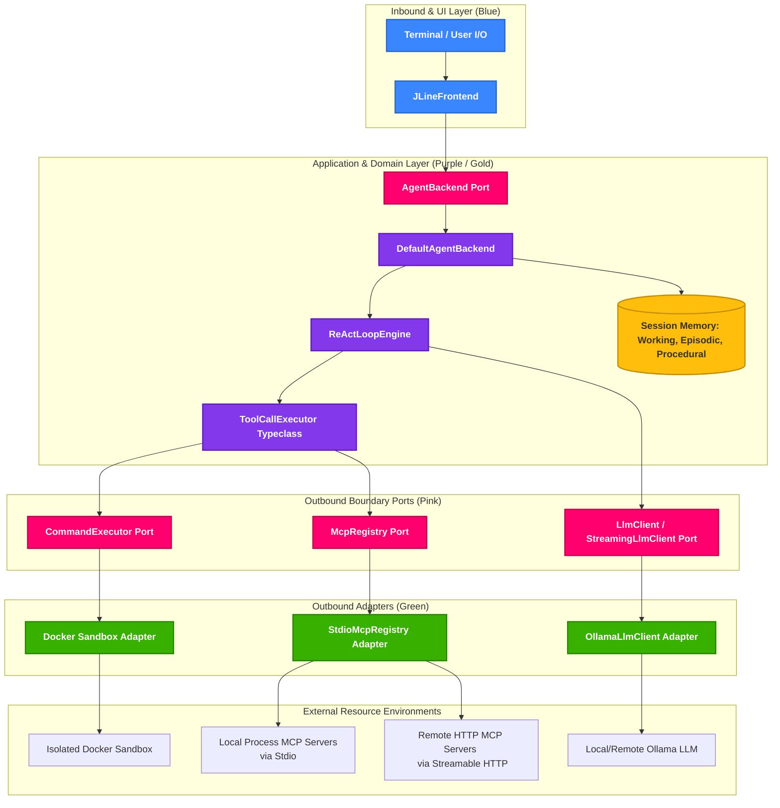

# Tark: An Educational LLM Agent Harness

Tark is an academic reference playground and learning implementation for **LLM Harness Engineering** built in **Scala 3** using functional programming principles with **Cats Effect**, **FS2**, and **Sttp**.

Rather than a closed or complex production framework, Tark is designed as a transparent, highly accessible reference model. Its core purpose is to help developers, students, and AI researchers learn how to build, control, and inspect AI agent loops from scratch. Based on modern software agent research, Tark acts as a controlled state machine: the LLM proposes reasoning and actions, but the Scala runtime retains complete control over state, tools, validation, verification, and safety boundaries.

---

## 🏗️ Functional System Architecture

Tark is built using a highly decoupled, strict **Hexagonal (Ports-and-Adapters) Architecture**. Below is the functional layout showing the path of data and actions from the user terminal down to the local sandboxes, Model Context Protocol (MCP) servers, and LLM instances:



---

## 💡 High-Level Concepts

Tark operates on several core architectural design principles to ensure reliability and safety:

*   **Controlled State Machine:** Unlike raw "agent loops" that delegate state control to the model, Tark’s runtime manages state transitions, parses outputs, enforces safety bounds, and halts execution when necessary.
*   **Structured Memory Layers:**
    *   **Working Memory (`AgentState`):** Fast, in-memory scratchpad tracking the current message transcript, candidate answer, goal, deliverable, open questions, assumptions, and tool results.
    *   **Episodic Memory:** Stores summaries of prior sessions to resume context across chat startups.
    *   **Procedural Memory:** Holds registered recipes and skills.
*   **Execution Sandbox:** All command-based tools run inside an isolated Docker sandbox container rather than directly on the developer's host machine.
*   **Model Context Protocol (MCP) Integration:** Tark provides full, out-of-the-box MCP integration supporting:
    *   **Local Stdio Subprocesses:** Spawns and manages local process-based MCP servers over standard streams securely.
    *   **Remote HTTP Streamable HTTP:** Subscribes to remote, high-performance HTTP servers utilizing the modern `Streamable HTTP` standard.
    *   **Auto-Discovery:** Automatically lists, parses, and translates schemas from registered servers on startup and injects them directly into the LLM context.
    *   **Resilient Lifecycle:** Completely leak-proof process management ensuring Netty thread pools and processes are closed gracefully on exit or timeouts.

---

## 📂 Hexagonal Package Structure

The repository is organized according to the following strict hexagonal package layout:

```text
src/main/scala/com/tark/
  domain/       Pure state, memory, and OpenAI-compatible tool protocol values. (Zero outer layers imports).
  ui/           Portable terminal/frontend action language and typeclasses.
  application/  Provider-neutral backend orchestration, use cases, and ReAct loop.
  ports/        Inbound and Outbound boundary interfaces (e.g., LlmClient, McpRegistry).
  adapters/     Ollama, Docker, JLine, and Stdio/Streamable HTTP MCP implementations.
  bootstrap/    Runtime configuration, settings.json loader, and composition root wiring.
```

Statically enforced package dependency rules are validated inside `HexagonalBoundarySpec`. Any layer violation (such as `domain` importing `ports`) will fail the build.

---

## 🔄 State Machine & Convergence Rules

Tark executes a compact, deterministic prompt/tool loop:

```
[Prompt] -> [LLMResponse(content, no tool calls)] -> [Persist assistant message]
   |
   v
[LLMResponse(content, tool calls)] -> [ToolCallExecutor Typeclass] -> [ToolResult] -> [Prompt with tool messages]
```

To guarantee that the agent converges and does not loop indefinitely, Tark enforces a strict tool-depth budget of **10 tool-response turns**. Once reached, Tark halts and returns a safety warning.

---

## 🛠️ Developer Quick Start

### Pre-requisites
1.  **Docker:** Ensure Docker is running locally (`docker ps`).
2.  **Ollama:** Install Ollama and run your model of choice:
    ```bash
    ollama run qwen3-coder:30b
    ```

### Configuration & MCP Server Registration
All MCP servers are configured in `.tark/settings.json` in your workspace folder.

```json
{
  "mcpServers": {
    "sqlite": {
      "command": "npx",
      "args": ["-y", "@modelcontextprotocol/server-sqlite"],
      "env": {}
    },
    "weather-service": {
      "type": "http",
      "url": "http://localhost:8080/mcp"
    }
  }
}
```

- **Command (Local Stdio):** Specify `command` and `args` to launch process subprocesses. All `stderr` logs are automatically written with line-truncation to `.tark/mcp.log` to prevent terminal overlaps.
- **Remote (Streamable HTTP):** Specify `"type": "http"` and `url` to hook into remote streaming HTTP servers.

### Running Tark
Run the interactive CLI using sbt:
```bash
sbt run
```

---

## 🧪 Testing Reference

### Running All Tests
Execute the entire test suite (including hexagonal architecture validations):
```bash
sbt "testOnly *Spec"
```

To run a specific test suite:
```bash
sbt "testOnly com.tark.application.backend.ReActLoopEngineSpec"
```

---

## 📚 Architecture References

*   [`ARCHITECTURE.md`](ARCHITECTURE.md): target hexagonal package structure, dependency rules, and migration glossary.
*   [`docs/harness-engineering-guide.md`](docs/harness-engineering-guide.md): background notes for the educational harness design.
